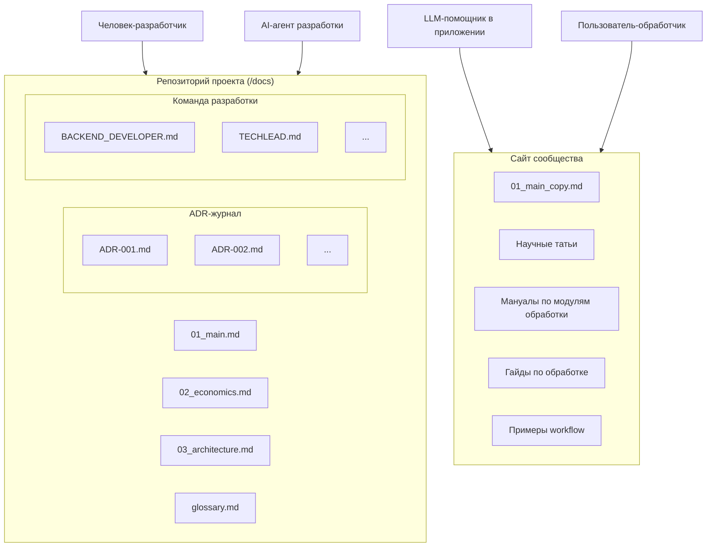
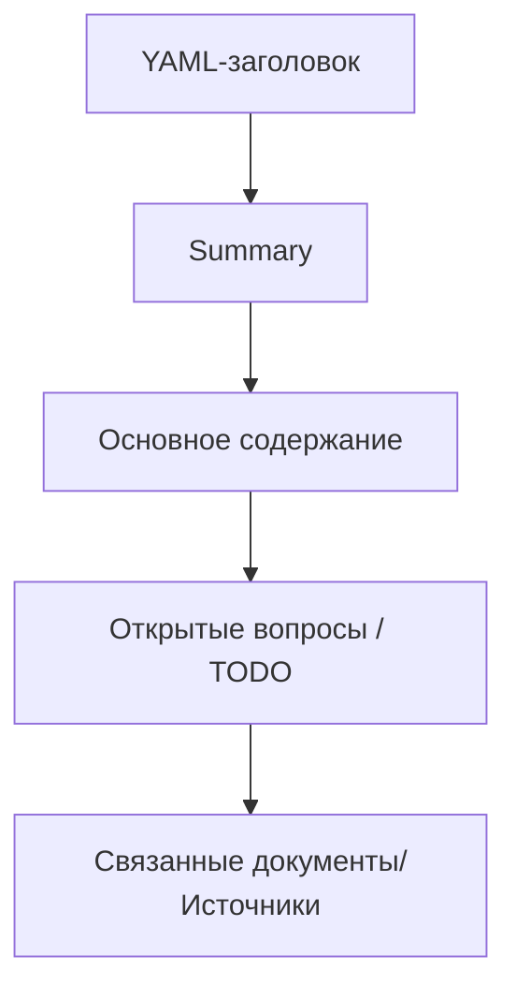

---

  
title: "docs_rules"

id: "000"

status: "draft"

version: "1.0"

last_updated: "2026-08-18"

audience: ["human", "dev-agent", "rag-assistant"]

related: ["glossary.md", "agent-rules.md"]

supersedes: []

  

# Правила написания статей проекта

Этот документ — единый регламент оформления и построения структуры файла для всех статей из серии разработки софта. Основной идеей создания правил оформления для всей документации проекта является в первую очередь удобство и читаемость документов для человека и ИИ.

  

## 1. Кто читает статьи и почему это важно

| Читатель | Цель | Требования к оформлению |
|---|---|---|
| Человек-разработчик | Понимание контекста, истории принятых решений | Живой язык допустим, но факты должны быть проверяемы по ссылкам на источник |
| Обработчик | Удобное и быстрое чтение мануалов | Живой язык допустим, но факты должны быть проверяемы по ссылкам на источник |
| AI-агенты для разработки (Cursor/Claude) | Чёткие, однозначные инструкции и правила | Нужны явные списки, таблицы, ссылки на файлы |
| LLM-помощник в приложении (RAG) | База знаний и доп. контекст в промпте | Каждый раздел должен иметь смысл и структуру. Желательно без чтения всей статьи целиком |  
  

> Одно и то же предложение будет одновременно прочитано человеком и
> использовано как контекст в ИИ-модели.

  

## 2. Расположение документации

Схема ниже описывает структуру документации и распределение ролей в AI‑ориентированном проекте: разработчики и AI‑агенты работают с готовой документацией для разработки (ADR, мануалы, описания архитектуры и прочее) в репозитории, а пользователи и LLM‑помощник используют уже другие материалы через сайт сообщества (мануалы, статьи, workflows). Ключевой принцип — прозрачность архитектурных решений за счёт фиксации их в ADR‑записях, а также разделение контента на внутреннюю техническую документацию и внешние обучающие материалы. Такая организация поддерживает масштабируемость знаний и согласованную работу всех участников проекта.

**Правило:** статьи о проектировании и разработке софта находятся в репозитории рядом с кодом [/docs](https://github.com/mleo20014-del/deghost_with_ai/tree/main/docs). Статьи по использованию софта (по модулям обработки) публикуются на [сайте сообщества](сайта-пока-что-нет) и индексируются отдельным RAG-контуром помощника внутри приложения (planned for article site.md, status: not written).

Не смешивай эти два потока в одном файле или одной директории.

## 3. Структура файла статьи

Каждая статья — отдельный .md файл со следующей обязательной последовательностью:

### 3.1 Front-matter (YAML-заголовок)

    ---
    
    title: "Название статьи"
    id: "Идентификатор статьи" # начиная с "001"
    status: "draft"  # draft | reviewed | accepted | deprecated |superseded  
    version: "1.0"
    last_updated: "2026-07-30"
    audience: ["human", "dev-agent", "rag-assistant"]
    related: ["01_main", "glossary"]
    supersedes: [] # id предыдущей версии
    
    ---

**Front-matter** обязателен для всех статей без исключений. Это минимум метаданных, без которого ни человек, ни агент не смогут понять актуальность и место документа в общей структуре. Разработчикам нужен способ хранить историю, которая одинаково хорошо читалась бы людьми и обрабатывалась программами. 
YAML решил эту задачу за счёт минимализма. Для описания структуры данных используются только пробелы, двоеточия и дефисы. В этом формате данные всегда представлены либо как пары «ключ-значение», либо как списки. Этого достаточно, чтобы описать структуру или историю изменений. YAML объединяет эти инструменты не просто как формат данных, а как общий язык версификации и коммуникации между человеком и инфраструктурой.

### 3.2 Краткое summary (2-4 предложения)

Сразу после заголовка YAML идёт абзац, отвечающий на вопрос «о чём эта статья» без необходимости читать её целиком. Это сильно повышает качество поиска (retrieval quality) в системах RAG и знакомит человека с содержанием статьи.

### 3.3 Основное содержание

Разбито на секции с заголовками. Каждая крупная секция также должна открываться коротким пояснением (1-2 предложения), что в ней будет.

### 3.4 Блок "Открытые вопросы / TODO"

В конце каждой статьи — список нерешённых вопросов или запланированных уточнений.
Сделано чтобы не прятать неопределённость внутри текста. Выноси неточности и недосказанность в TODO.

### 3.5 Блок "Связанные документы"

Список *id* других статей, выпуски из ADR-журнала, которые логически связаны с текущей темой. 

> Используй *id* и название файла при создании ссылки. Присвоенный статье *id* не должен меняться при переименовании файла.

## 4. Правила ссылок/связей между статьями

• Если статья, на которую хотелось бы сослаться ещё не написана, используйте указатель с явным статусом:

> (planned for article 03_architecture, status: not written)

• Ссылки внутри текста оформляются вот таким образом: [мой файл из репозитория](https://github.com/mleo20014-del/deghost_with_ai/tree/main/docs)

 `[текст ссылки](путь до расположения файла внутри репозитория)`

## 5. Работа с терминами и глоссарий

• Глоссарий собирается с самого старта проекта в отдельном файле [glossary.md](https://github.com/mleo20014-del/deghost_with_ai/blob/main/docs/glossary.md)

• Первое упоминание узкоспециализированного термина в статье —  создаётся короткая пометка в глоссарии или полное определение (на усмотрение) + ссылка на этот термин. 

Пример:

...используется технология [RAG](./glossary.md#архитектура-программного-обеспечения) внутри локальной ИИ-модели...

    ...используется технология [RAG](./glossary.md#архитектура-программного-обеспечения) внутри локальной ИИ-модели...

> Для создания такой ссылки необходимо установить формат "#### термин" в глоссарии, чтобы можно было создать ссылку на это слово/фразу. Затем необходимо скопировать путь и вставить в контекст по примеру выше

## 6. Разделение фактов, предположений и решений

Каждое утверждение в статье должно быть промаркировано одним из трёх типов, если оно не тривиально:

| Маркер | Значение | Пример |
|---|---|---|
| `[FACT]` | Проверяемый факт, есть обоснование | `[FACT]` Python 3.13 используется как основной язык проекта |
| `[ASSUMPTION]` | Предположение, не проверено практикой | `[ASSUMPTION]` Скорость обработки данных будет ниже, чем у существующих ПО |
| `[DECISION]` | Осознанное архитектурное решение с обоснованием | `[DECISION]` Хранение метаданных — в PostgreSQL, обоснование — см. в [ADR-004](https://github.com/mleo20014-del/deghost_with_ai/tree/main/docs) |

Это разграничение особенно важно для агента разработки: он не должен реализовывать код на основе [ASSUMPTION] как на основе [FACT].

## 7. Формат протокола принятия решений. ADR-журнал

ADR-журнал содержит в себе информацию и пояснения по выбору того или иного решения/инструмента в процессе разработки.  
Любое значимое архитектурное решение (выбор языка программирования, выбор БД, формата хранения, паттерна, взаимодействия модулей и многое другое) оформляется отдельной записью в *docs/ADR/ADR-id-title.md* по стандартному [шаблону](https://github.com/architecture-decision-record/architecture-decision-record/tree/main/locales/en/templates/decision-record-template-by-michael-nygard) Michael Nygard.

Пример:

    ### ADR-id-title: Выбор PostgreSQL для хранения метаданных
    Краткое описание...
   
    ### 1. Статус
    Какой у него статус? Например, предложен, принят, отклонен, устарел, заменен и т.д.
    
    ### 2. Контекст
    Почему возникла необходимость в решении, какие были ограничения?
    
    ### 3. Решение
    Какие изменения мы предлагаем и/или внедряем?
    
    ### 4. Альтернативы
    Что ещё рассматривалось и почему отклонено?
    
    ### 5. Последствия
    Что станет проще или сложнее сделать в результате этих изменений, что это значит для дальнейшей разработки?

 ### Правила ведения ADR:

• Один файл ADR = одно решение. Не смешивать несколько решений в одной записи.

• Статус ADR обновляется, но текст принятой записи **не переписывается** — при изменении решения создаётся новый ADR с ссылкой supersedes.

• Нумерация сквозная, независимо от статьи, к которой ADR относится.

## 8. Визуализация. Диаграммы и схемы

GitHub, GitLab, VS Code preview и большинство современных Markdown-рендереров нативно распознают такой блок и рисуют из него SVG-диаграмму прямо при просмотре файла. Человек видит красивую картинку, а любой RAG-пайплайн или LLM, который читает файл как текст, увидит этот код и обработает его как структурированные данные. Mermaid-синтаксис декларативен и семантически прозрачен для модели, поэтому современные LLM (включая Claude, GPT) отлично извлекают смысл оттуда
Сайт [Mermaid](https://mermaid.js.org/).

### Правила:
• Все схемы обязаны быть в формате Mermaid  и встроены в .md файл как блок кода mermaid. Не используй внешние картинки. Mermaid-код сам по себе легко читаем и человеком, и агентом, и не требует особого рендеринга 

• Разрешены любые типы диаграмм, которые будут совместимы и будут отображаться в виде SVG в просмотрщике .md файла. Рекомендуются: flowchart, sequenceDiagram, classDiagram, gitGraph

• У каждой диаграммы должна быть подпись до и после: что она показывает и какой вывод из неё нужно сделать.

• Диаграмма не заменяет текст — она его дополняет. Ключевые факты дублируются словами, чтобы поиск по тексту (в т.ч. RAG) их находил.

• Важно не разрывать mermaid-блок посередине, а держать его как один    неделимый чанк, иначе граф синтаксически развалится и модель с RAG не сможет его распарсить целиком.

## 9. Стиль изложения

• Пиши короткими абзацами (3-5 предложений).

• Не используй фразеологизмы, эпитеты, риторические и сложные речевые конструкции. Особенно при написании `[FACT]` фактов . Неформальный тон допустим только в Summary, TODO и в местах с пометкой `[ASSUMPTION]` перед текстом с мнением. Запрещено в разделах с `[FACT]` и `[DECISION]` утверждениями.

• Списки должны быть простыми, без вложенных пунктов. Если нужна вложенность, тогда выноси это в таблицу.

• Каждый список из более чем 5 пунктов группируйте по подтемам с собственным подзаголовком  ###.

• Не используй безличные ссылки на будущее без даты/версии: не «когда-нибудь добавим», а «запланировано на этап X, статья 03_architecture».

## 10. Чек-лист перед публикацией статьи

 - [ ] Есть front-matter со всеми обязательными полями
       
 - [ ] Есть краткое summary в начале

 - [ ] Все термины при первом употреблении сопровождены ссылкой на глоссарий

 - [ ] Нет расплывчатых ссылок «см. далее» без id статьи

 - [ ] Факты, предположения и решения промаркированы

 - [ ] Значимые архитектурные решения вынесены в отдельный ADR

 - [ ] Диаграммы (если есть) — в формате Mermaid, с подписью до/после

 - [ ] Есть блок "Открытые вопросы / TODO"

 - [ ] Есть блок "Связанные документы"

# Открытые вопросы/ TODO

1. Наладить ссылки на источники
2. Разобраться с навигацией по id. Между статьями и журналом
3. Разобраться с версионированием статей. Что делать если она устарела и как безболезненно обновить
4. Сделать небольшой мануал по стандартным инструментам и соглашениям в оформлении .md файлов на Github

# Связанные документы

| id | Имя | О чём |
|---|---|---|
| 001 | 01_main | Главный файл в проекте о целях и задачах проекта |
| 002 | glossary | Список используемых терминов в проекте |
