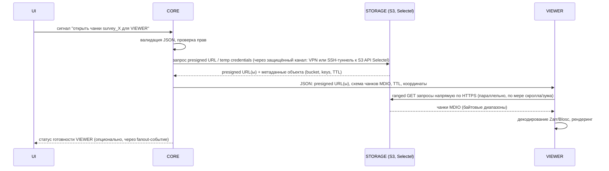

```mermaid
sequenceDiagram
    participant UI
    participant CORE
    participant S3 as STORAGE (S3, Selectel)
    participant VIEWER

    UI->>CORE: сигнал "открыть чанки survey_X для VIEWER"
    CORE->>CORE: валидация JSON, проверка прав
    CORE->>S3: запрос presigned URL / temp credentials (через защищённый канал: VPN или SSH-туннель к S3 API Selectel)
    S3-->>CORE: presigned URL(ы) + метаданные объекта (bucket, keys, TTL)
    CORE->>VIEWER: JSON: presigned URL(ы), схема чанков MDIO, TTL, координаты
    VIEWER->>S3: ranged GET запросы напрямую по HTTPS (параллельно, по мере скролла/зума)
    S3-->>VIEWER: чанки MDIO (байтовые диапазоны)
    VIEWER->>VIEWER: декодирование Zarr/Blosc, рендеринг
    CORE-->>UI: статус готовности VIEWER (опционально, через fanout-событие)
```
